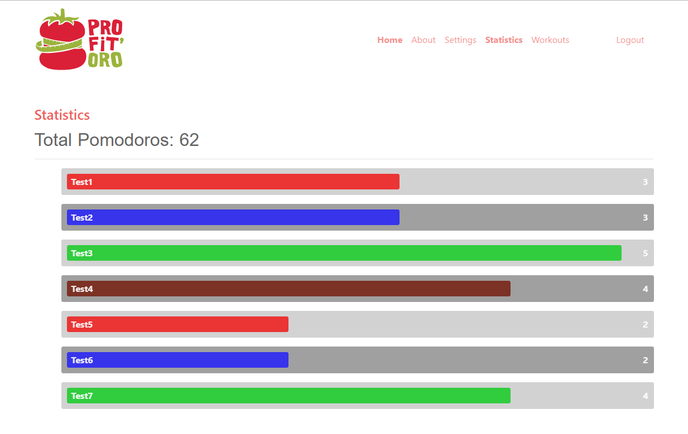
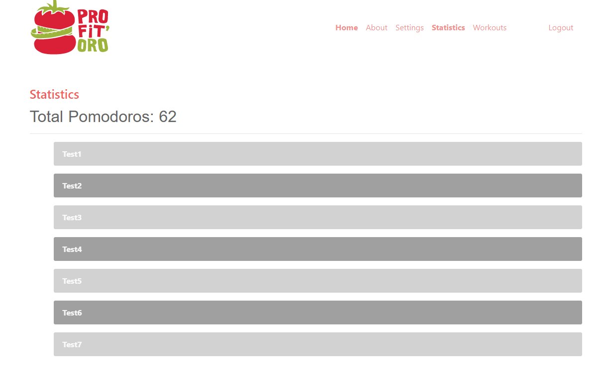
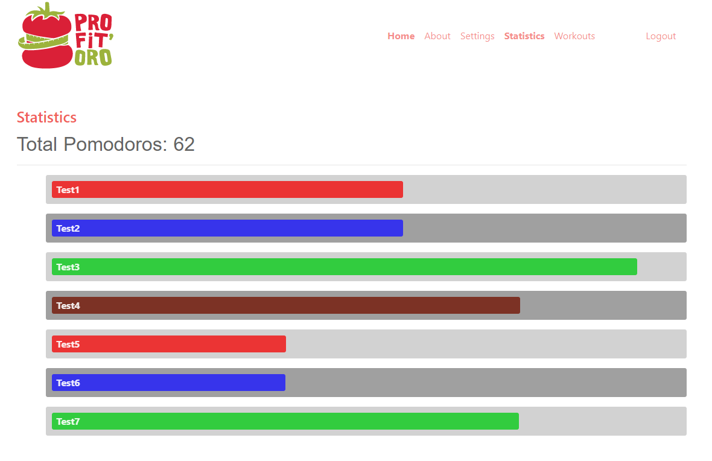
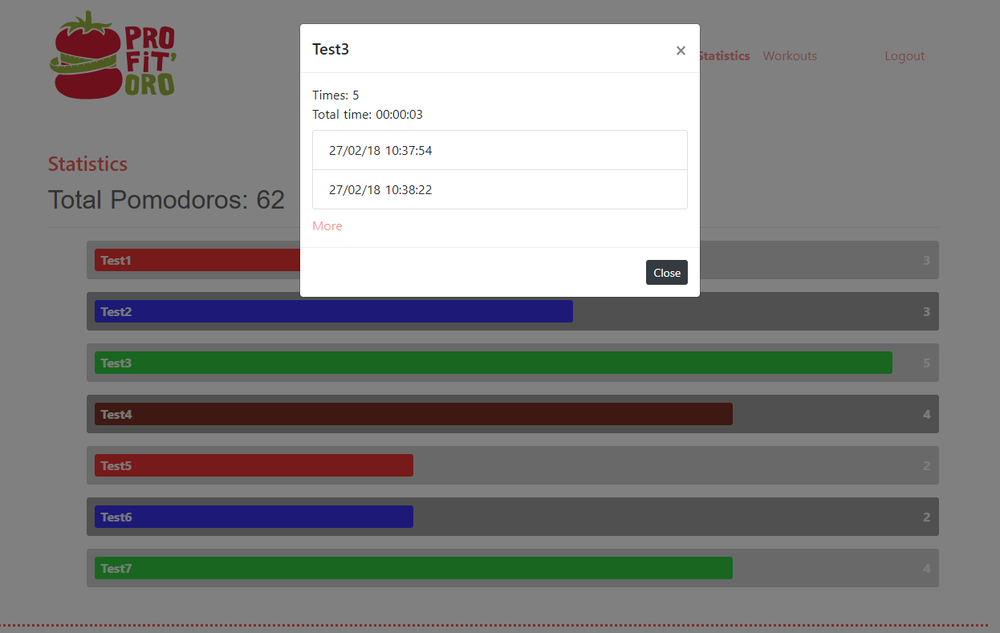

Examen Segunda Evaluación
=========================

* Nota: Cada pregunta se valorará como bien o como mal (valoraciones intermedias serán excepcionales).
* Nota2: En cada pregunta se especifica si se valora en el examen de diseño o en el de desarrollo.
* Nota3: Para aprobar cada examen hay que obtener una puntuación mínima de 5 puntos en ese examen.
* Nota4: Organice su tiempo. Si no consigue resolver un apartado pase al siguiente. El examen consta de ejercicios que se pueden resolver de forma independiente. Los apartados de diseño y de desarrollo también se pueden resolver por separado. Si un apartado depende de otro que no sabe resolver, siempre puede dar una solución que aunque no sea correcta, le permita seguir avanzando.
* Nota5: Para que una solución sea correcta, no sólo hay que conseguir que haga lo que se pide, sino que además todo lo que funcionaba lo tiene que seguir haciendo.
* Nota6: Lea completamente el examen antes de empezar y comience por lo que le parezca más fácil.

## EXAMEN

El único apartado pretende que se puedan consultar los ejercicios físicos (workouts) realizados durante las pausas.

#### 1.- Estadísticas de ejercicios.

#### 1.1- (1 punto desarrollo) Actualmente la aplicación elige aleatoriamente un ejercicio físico. La información del ejercicio realizado debe almacenarse en la base de datos.

* Nota: Como mínimo hay que almacenar el número de veces que se ha realizado cada ejercicio.
* Nota: No es necesario esperar a la finalización del ejercicio para almacenarlo en la base de datos.
* Nota: Las estadísticas se refieren a los ejercicios realizados por un usuario concreto.

#### 1.2- Al navegar a estadísticas, se mostrará la información de cada ejercicio realizado.

#### 1.2.1- (2 puntos, desarrollo) Por leer en Firebase y mostrar la información actual.
#### 1.2.2- (1 punto, desarrollo) La información se actualizará en tiempo real.
#### 1.2.3- (1 punto, diseño) Por el diseño de un workout individual: Reproduzca fidedígnamente la imagen mostrada. Observe los colores de fondo y de fuente, los márgenes y paddings, el tamaño de los elementos y fíjese en la alineación.
#### 1.2.4- (1 punto desarrollo) Cada workout tendrá un ancho que será proporcional al número de veces que haya sido realizado. El workout con mayor frecuencia ocupará todo el ancho disponible respetando márgenes y el resto tendrán un ancho proporcional a éste.

* Nota: Por ejemplo, si el workout con mayor realización es de tres, un workout que se haya hecho una vez ocupará el 33%.

#### 1.2.5- (1 punto diseño) Habrá dos fondos grises y para cada workout se alternarán.
#### 1.2.6- (1 punto diseño) Se utilizarán cuatro colores para representar lo workouts y si hay más de cuatro que mostrar se repetirá la secuencia de colores.
#### 1.2.7- (1 punto diseño) El diseño será responsivo: El tamaño que ocupara cada workout se adaptará al tamaño de pantalla disponible.
#### 1.2.8- Los workouts se mostrarán con transiciones. La transición se repetirá cada vez que se pulse sobre estadísticas según la siguiente secuencia:

#### 1.2.8.0- Primero se mostrarán los títulos de los workouts

#### 1.2.8.1- (2 puntos diseño) Después de un segundo, los workouts alcanzarán el tamaño adecuado durante dos segundos

#### 1.2.8.2- (1 punto diseño) Transcurridos tres segundos se mostrará el número de veces que ha sido realizado cada workout.

#### 1.3- Al pulsar sobre un workout, se mostrará la información detallada de su realización.

#### 1.3.1- (1 punto, desarrollo) En Firebase se tendrá que almacenar la información adicional.
#### 1.3.2- (1 punto, desarrollo) Al pulsar sobre un workout, se mostrará la información de detalle únicamente de ese workout.
#### 1.3.3- (1 punto, diseño) La información se mostrará en un diálogo modal.
#### 1.3.4- (1 punto, diseño) El estilo del modal será el de la imagen.
#### 1.3.5- (1 punto, diseño) El diálogo se ocultará al pulsar sobre "X" o sobre "close".
#### 1.3.6- (1 punto, desarrollo) La información se mostrará formateada.

Nota: Formato de horas: hh:mm:ss y de fechas: d/m/yyyy hh:mm:ss

#### 1.3.7- (2 puntos, desarrollo) Se implementará un sistema de paginación para mostrar los ejercicios.

Nota: Puede elegir libremente el sistema de paginación que prefiera.
